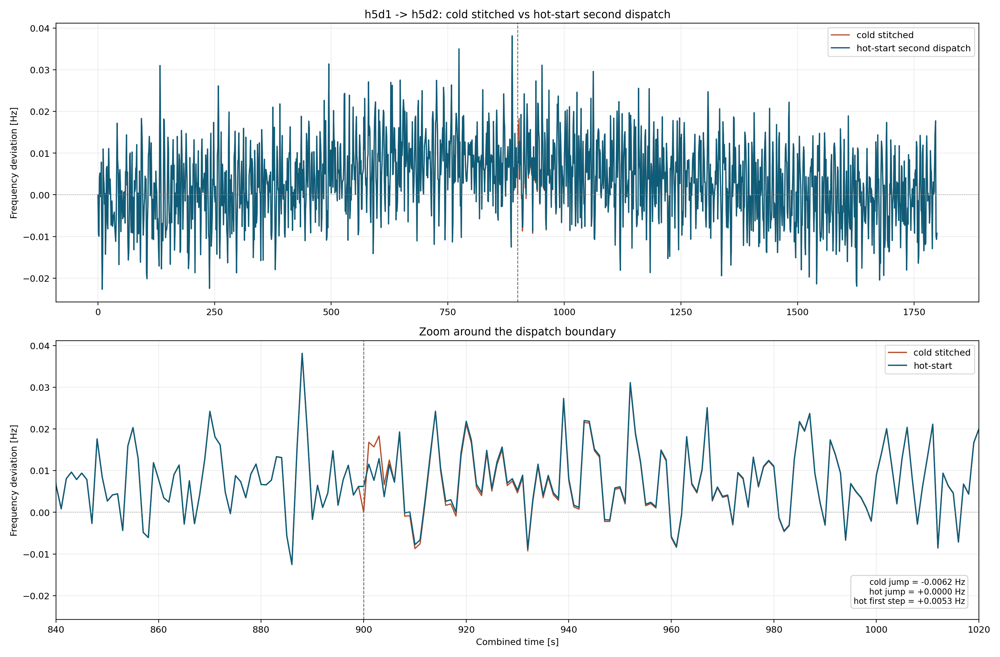
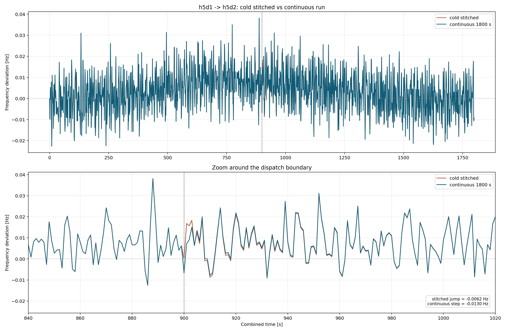
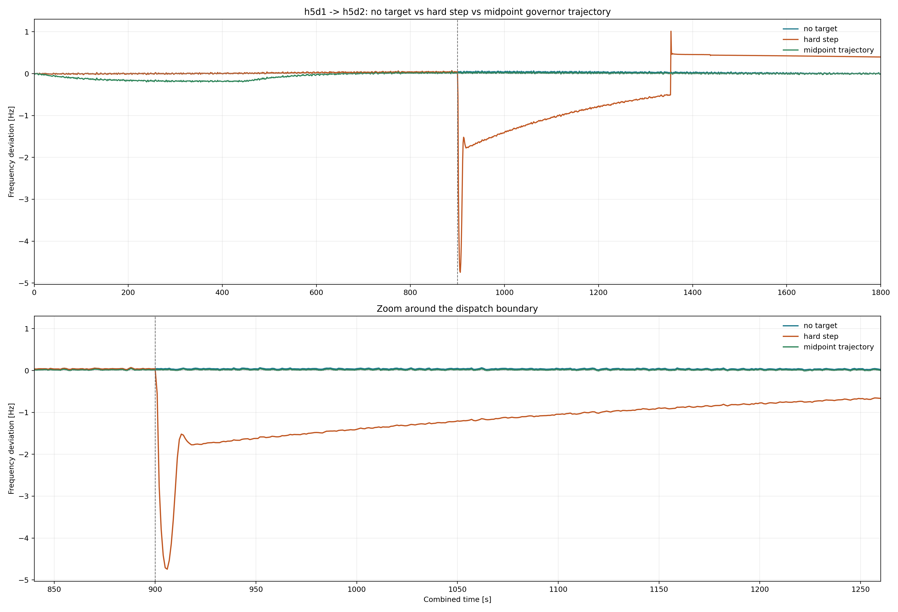
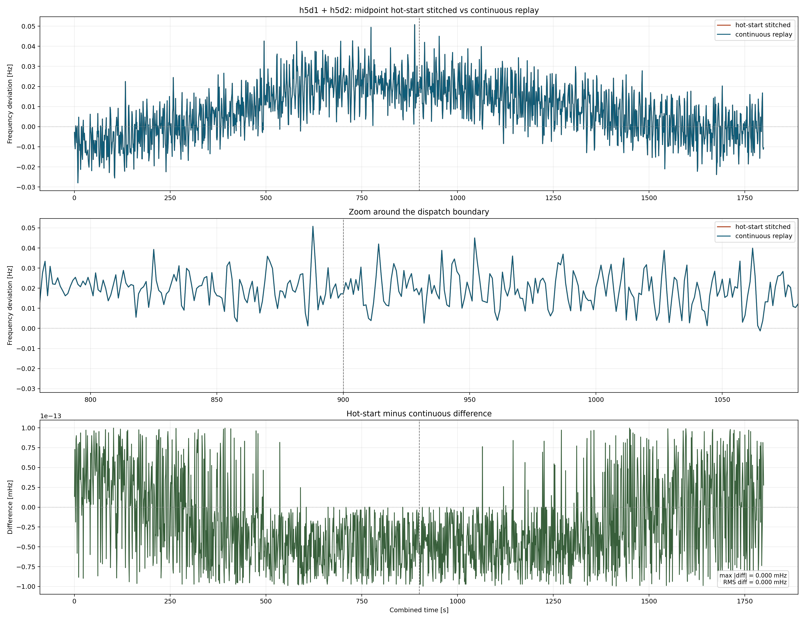
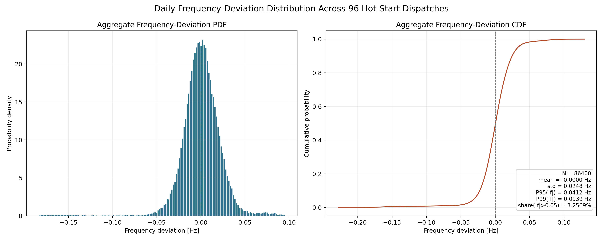
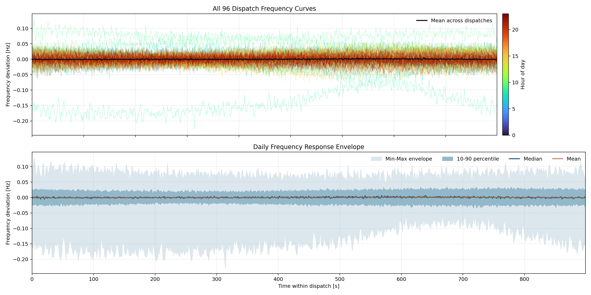

# Deadband Demo Refresh

This directory contains a stable-branch refresh of the original deadband demo.
The goal of the refresh is not to preserve the old notebook layout byte-for-byte,
but to make the workflow reproducible on current ANDES/AMS code while keeping
the key frequency-control behaviors visible.

The scripts here assume an `openandes` workspace where `andes/`, `ams/`, and
`demo/` are sibling folders. If you export this demo elsewhere, set
`OPENANDES_WORKSPACE=/path/to/workspace` so the scripts can still locate the
local source trees.

## What was wrong in the original demo

1. The old README required installing a development-only `andes@pvd2` branch
   because the case still used `PVD2` and `ESD2`.
2. The old workflow was tightly coupled to a live AMS-to-ANDES handoff, which
   became brittle once AMS/ANDES 2.0 internals changed.
3. Each 15-minute dispatch was simulated as a cold start. Adjacent dispatches
   therefore showed an artificial boundary reset, even when the operating point
   should have evolved continuously.
4. After switching initialization from dispatch averages to the first curve
   sample in the interval, some dispatches failed because `CurveInterp.csv`
   contained negative PV samples created by interpolation plus noise.
5. The AGC governor limit path had a sign bug: saturation logic needed to
   preserve the sign of the requested AGC correction while respecting available
   upward and downward headroom.
6. Even after introducing hot starts, directly applying the next dispatch OPF
   target to governor `pref0` at the interval boundary created a non-physical
   frequency shock. The OPF output is a coarse 15-minute waypoint, not an
   instantaneous mechanical-power step command.

## What changed

- `scripts/run_dispatch_tds.py`
  - accepts either a precomputed `dispatch JSON -> TDS` workflow or a fresh AMS
    ACOPF recomputation when `--dispatch-json` is omitted;
  - auto-adapts the legacy dynamic workbook from `PVD2/ESD2` to stable
    `PVD1/ESD1`, and inserts `fdbdu` so the upper deadband remains explicit on
    stable ANDES;
  - defaults to `init_mode=first`, `agc_interval=4`, `kp=0.03`, `ki=0.01`;
  - fixes AGC governor clipping so positive commands are not incorrectly routed
    through the negative limit.
- `scripts/run_day_dispatch_tds.py`
  - generalizes the demo to arbitrary `hXdY` dispatches and full 96-dispatch
    daily sweeps;
  - keeps `init_mode=first` as the default and can retry early failures with a
    fallback init mode if needed.
- `scripts/prepare_day_dispatches.py`
  - precomputes a reusable `dispatch JSON` library so OPF and TDS can be
    decoupled cleanly.
- `scripts/hotstart_checkpoint.py`
  - saves parameter-specific disk checkpoints containing the ANDES snapshot, AGC
    state, and the runtime context required to resume the next interval.
- `scripts/run_dispatch_hotstart.py` and `scripts/run_day_dispatch_hotstart.py`
  - run one interval per process while passing terminal state from one dispatch
    to the next through disk checkpoints;
  - apply boundary dispatch targets only to conventional governors;
  - support `governor_target_schedule=midpoint_trajectory`, which is now the
    recommended boundary treatment.
- `scripts/scale_curve_interp.py`
  - generates stress-test variants of `CurveInterp.csv` by scaling load, wind,
    and PV columns while preserving the original format expected by the demo.
- `scripts/plot_day_hotstart_results.py`
  - aggregates a 96-dispatch hot-start sweep into a frequency-distribution plot,
    grouped curve panels, and a CSV summary of key frequency-quality metrics.
- `scripts/compare_dispatch_pair_hotstart.py`
  - compares cold-stitched and hot-started boundary behavior;
  - now supports smooth governor-target schedules instead of only a boundary
    hard step.
- `scripts/run_dispatch_pair_continuous.py`
  - runs two adjacent dispatches as a single 1800-second simulation and can
    directly plot the result against the cold-stitched baseline.
- `scripts/compare_dispatch_pair_midpoint_continuous.py`
  - validates that midpoint-trajectory hot-start stitching matches the
    corresponding continuous replay started from the same boundary checkpoint.
- `cases/CurveInterp.csv`
  - clips PV samples to non-negative values so `init_mode=first` is physically
    valid and no longer trips over negative irradiance artifacts.

## Stable model migration

The historical deadband case used custom `PVD2` and `ESD2` sheets to work
around missing stable-branch support.

- `ESD2` is no longer needed here because stable `ESD1` is sufficient for this
  demo.
- `PVD2` is migrated to `PVD1` with an explicit `fdbdu` column so the legacy
  deadband intent remains representable on stable ANDES.

The source workbook remains `cases/IL200_dyn_db2.xlsx`. A stable-compatible copy
is generated automatically when the scripts run.

## Recommended boundary treatment

The current recommended workflow is:

1. Compute or reuse quarter-hour dispatch JSON files.
2. Run TDS one interval at a time with disk checkpoints between intervals.
3. Apply dispatch targets only to conventional generator governors.
4. Do **not** hard-switch governor `pref0` to the next interval target at the
   boundary.
5. Instead, use a midpoint trajectory for interval `k`:
   - left boundary: `0.5 * (P_{k-1} + P_k)`
   - interval midpoint: `P_k`
   - right boundary: `0.5 * (P_k + P_{k+1})`

This interpretation treats each OPF dispatch as a waypoint inside the 15-minute
window rather than an instantaneous step at the boundary. It removes the
artificial frequency dip caused by a direct target jump while preserving
continuity across separately executed segments.

`PVD1` and `ESD1` are not used as dispatch-target devices at the boundary in the
current release path. Their behavior continues to come from the replayed curve
and AGC path; only conventional governors receive the dispatch-target schedule.

## Reproduce the 5h midpoint hot-start validation

Run the commands below from `demo/deadband/`.

```bash
python scripts/prepare_day_dispatches.py \
  --hour-start 5 --hours 1 --workers 1 \
  --results-dir results/repro_h5_dispatches

python scripts/run_day_dispatch_hotstart.py \
  --dispatch-dir results/repro_h5_dispatches \
  --hour-start 5 --hours 1 \
  --results-dir results/repro_h5_midpoint_segments \
  --checkpoints-dir results/repro_h5_midpoint_checkpoints \
  --kp 0.03 --ki 0.01 --agc-interval 4 \
  --init-mode first \
  --apply-governor-targets \
  --governor-target-schedule midpoint_trajectory

python scripts/compare_dispatch_pair_midpoint_continuous.py \
  --checkpoint-in results/repro_h5_midpoint_checkpoints/<family_hash>/end_h5d0 \
  --first-dispatch-json results/repro_h5_dispatches/h5d1_dispatch.json \
  --second-dispatch-json results/repro_h5_dispatches/h5d2_dispatch.json \
  --third-dispatch-json results/repro_h5_dispatches/h5d3_dispatch.json \
  --first-hotstart-csv results/repro_h5_midpoint_segments/h5d1_frequency.csv \
  --second-hotstart-csv results/repro_h5_midpoint_segments/h5d2_frequency.csv \
  --kp 0.03 --ki 0.01 --agc-interval 4 \
  --results-dir results/repro_h5_midpoint_compare
```

Notes:

- `prepare_day_dispatches.py` produces parameter-independent dispatch JSON
  files. You can reuse them across multiple AGC/deadband experiments without
  rerunning AMS ACOPF every time.
- `run_day_dispatch_hotstart.py` prints the resolved checkpoint family
  directory. Replace `<family_hash>` in the comparison command with the hash
  printed by that run.
- The recommended path is now disk hot-start, not the earlier memory-only
  boundary experiment.
- The release bundle committed to this repo is intentionally small. For larger
  sweeps, regenerate locally instead of committing the full `results/` tree.

## Validation figures

The committed release artifacts live in `results/release_h5_pair/`.

### 1. Historical: cold-stitched vs memory hot-start second dispatch

Committed figure:



Key numbers from
[`results/release_h5_pair/h5d1_h5d2_default_statehot_hotstart_summary.csv`](results/release_h5_pair/h5d1_h5d2_default_statehot_hotstart_summary.csv):

- cold boundary jump: `-0.00620 Hz`
- hot-start boundary jump: `0.00000 Hz`
- immediate post-boundary hot-start step: `+0.00534 Hz`

This shows the cold restart discontinuity is numerical workflow error, not a
physical frequency response. Carrying the terminal dynamic state into the next
dispatch removes that jump.

### 2. Historical: cold-stitched vs continuous 1800-second run

Committed figure:



Key numbers from
[`results/release_h5_pair/h5d1_h5d2_default_continuous_vs_stitched_summary.csv`](results/release_h5_pair/h5d1_h5d2_default_continuous_vs_stitched_summary.csv):

- cold boundary jump: `-0.00620 Hz`
- continuous `899 s -> 900 s` step: `-0.01295 Hz`

The continuous run does not reset to zero at the dispatch boundary. Instead, it
shows a genuine dynamic step as the second interval begins, which is the
behavior the cold-stitched baseline was masking.

### 3. Legacy hard-step target update vs midpoint trajectory

Committed figure:



Key numbers from
[`results/release_h5_pair/h5d1_h5d2_midpoint_vs_legacy_summary.csv`](results/release_h5_pair/h5d1_h5d2_midpoint_vs_legacy_summary.csv):

- `hard step` boundary `0 -> 1 s` step: `-0.59136 Hz`
- `hard step` second-interval minimum: `-4.74445 Hz`
- `midpoint trajectory` boundary `0 -> 1 s` step: `+0.00560 Hz`
- `midpoint trajectory` second-interval minimum: `-0.02386 Hz`
- `midpoint trajectory` second-interval mean absolute deviation: `0.01143 Hz`

This is the key boundary-fix result. The large dip was not caused by hot start
itself; it came from interpreting the new dispatch target as an instantaneous
governor step. Replacing that step with a midpoint trajectory restores a
physically reasonable response.

### 4. Midpoint hot-start stitching vs corresponding continuous replay

Committed figure:



Key numbers from
[`results/release_h5_pair/h5d1_h5d2_midpoint_chain_summary.csv`](results/release_h5_pair/h5d1_h5d2_midpoint_chain_summary.csv):

- continuous minimum: `-0.02797 Hz`
- hot-start minimum: `-0.02797 Hz`
- maximum absolute difference: `9.97e-17 Hz`
- RMS difference: `5.72e-17 Hz`

This validates the current workflow end-to-end: running dispatches separately
with disk hot starts and midpoint governor trajectories reproduces the same
frequency trace as a continuous two-interval replay started from the same
boundary state.

### 5. Daily hot-start frequency quality under a stronger net-load trajectory

To create a less tranquil study condition for deadband experiments, the replay
curve was scaled to:

- load `x1.10`
- wind `x1.15`
- PV `x1.15`

The generated curve is committed as
[`cases/CurveInterp_load110_wind115_pv115.csv`](cases/CurveInterp_load110_wind115_pv115.csv).

The corresponding 96-dispatch ACOPF library and hot-start TDS chain are
committed in:

- [`results/dispatches_day96_curve110_wind115_pv115`](results/dispatches_day96_curve110_wind115_pv115)
- [`results/day96_hotstart_agc4_kp0p03_ki0p003_first_midpoint_curve110_wind115_pv115`](results/day96_hotstart_agc4_kp0p03_ki0p003_first_midpoint_curve110_wind115_pv115)
- `results/day96_hotstart_checkpoints_agc4_kp0p03_ki0p003_first_midpoint_curve110_wind115_pv115`

Run settings:

- `agc_interval = 4 s`
- `kp = 0.03`
- `ki = 0.003`
- `init_mode = first`
- governor targets applied only to conventional units
- boundary schedule `midpoint_trajectory`

Committed aggregate figures:





Key frequency-quality numbers from
[`results/day96_hotstart_agc4_kp0p03_ki0p003_first_midpoint_curve110_wind115_pv115/frequency_distribution_stats.csv`](results/day96_hotstart_agc4_kp0p03_ki0p003_first_midpoint_curve110_wind115_pv115/frequency_distribution_stats.csv):

- sample count: `86400`
- mean frequency deviation: `-3.79e-05 Hz`
- standard deviation: `0.02478 Hz`
- `P95(|Δf|) = 0.04125 Hz`
- `P99(|Δf|) = 0.09388 Hz`
- `max |Δf| = 0.22827 Hz`
- share with `|Δf| > 0.036 Hz`: `7.1678%`
- share with `|Δf| > 0.05 Hz`: `3.2569%`

This operating condition is intentionally rougher than the earlier baseline but
still remains numerically stable for a full 96-dispatch hot-start chain, making
it a useful starting point for deadband-sensitivity studies.

## Scope of this refresh

This refresh now covers both the stable ANDES/AMS migration and the boundary
execution model used for later deadband studies:

- stable `PVD1/ESD1` migration on current ANDES;
- reusable `dispatch JSON -> TDS` and `day dispatch JSON -> hot-start chain`
  workflows;
- corrected AGC governor clipping;
- realistic interval-to-interval continuity through disk checkpoints plus
  midpoint governor target trajectories.

It is the foundation for later deadband sensitivity studies, not the final word
on deadband tuning itself.

## License

This subdirectory follows the license in the repository root.
